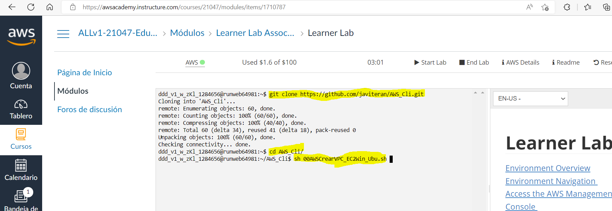
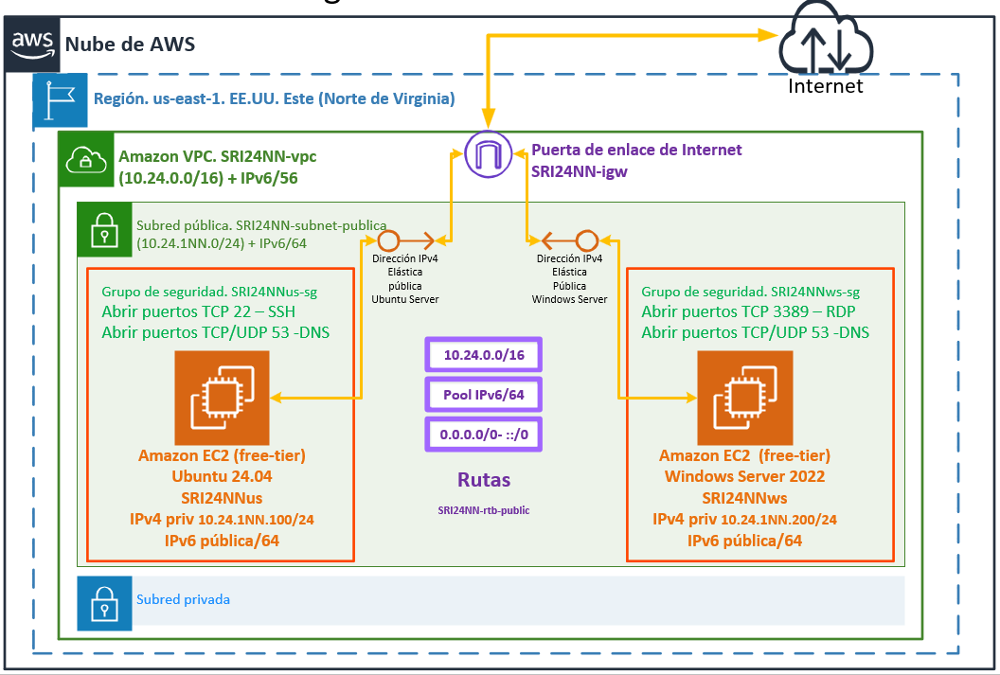

# :dizzy: Tareas en AWS Academy con AWS CLI

Cuando utilizamos AWS Academy y su learner lab puede interesarnos personalizar el entorno de los alumnos.

Muestra una posible solución de automatización de la creación de entornos de tareas en AWS con AWS CLI.

## :gear: Referencia de comandos AWS CLI

https://awscli.amazonaws.com/v2/documentation/api/latest/reference/ec2/index.html#cli-aws-ec2

## :collision: Configuración del entorno en el Learner Lab



## :hammer: Creación de entorno de tareas 00AWSCrearVPC_EC2Win_Ubu.sh

```git
git clone https://github.com/javiteran/AWS_Cli.git
cd AWS_Cli
sh 00AWSCrearVPC_EC2Win_Ubu.sh
```

Con este fichero se creará el siguiente entorno de tareas:



Creará:

* Una VPC
* Una subred pública
* Una puerta de enlace de internet
* La tabla de enrutamiento de la subred para permitir conectarse a internet
* Un grupo de seguridad para Ubuntu y otro para Windows
* Una instancia EC2 con Windows Server 2022 
* Una instancia EC2 con Ubuntu Server 22.04
* Direcciones IPs públicas para las instancias EC2
